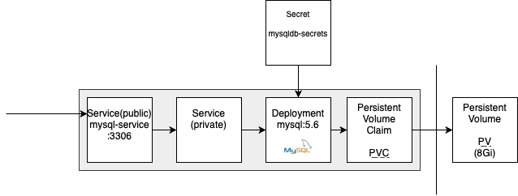

# Install MySQL into K8s Cluster
There are several steps that have to be performed. We want to install MySQL database from https://hub.docker.com/_/mysql image. There have to be done some things around than just pulling image, running container and keeping data.  
<p align="center">
  
</p>

## 0. Create K8s Secret called MySQL ROOT_PASSWORD
1. Encode master password via script to put into **Kubernetes Secret** [^1] with command `zsh 0-encode-base64.zsh password`
```
cGFzc3dvcmQ=
```
2. Put output base64 encoded password into secret and execute `kubectl apply -f 0-mysql-secret.yaml`
```
secret/mysqldb-secrets created
```
3. Run `kubectl get secret` to check all secrets in your cluster
```
NAME                  TYPE                                  DATA   AGE
default-token-4nxzv   kubernetes.io/service-account-token   3      97d
mysqldb-secrets       Opaque                                1      9m13s
pwnstepo-registry     kubernetes.io/dockerconfigjson        1      96d
```
4. Run `kubectl describe secret mysqldb-secrets` to check newly created secret
```
Name:         mysqldb-secrets
Namespace:    default
Labels:       <none>
Annotations:  <none>

Type:  Opaque

Data
====
ROOT_PASSWORD:  11 bytes
```
## Create PV and PVC on it. Create MySQL Deployment using PVC as storage
1. Execute `kubectl apply -f 1-pv-pvc-mysql.yaml`
```
persistentvolume/mysql-pv created
persistentvolumeclaim/mysql-pvc-claim created
```
2. Execute `kubectl apply -f 2-deployment-mysql.yaml`
```
service/mysql created
```
## Expose MySQL behind publicly accessible Service
1. Execute `3-service-mysql.yaml`
```
service/mysql-service created
```
2. Execute `kubectl get svc` to confirm that service is created successfully.
```
NAME                      TYPE        CLUSTER-IP      EXTERNAL-IP   PORT(S)    AGE
...
mysql                     ClusterIP   None            <none>        3306/TCP   7m1s
mysql-service             ClusterIP   10.245.2.59     <none>        3306/TCP   28s
...
```
# Your mysql-service is live!
Your newly installed  database is then accessible on **mysql-service** or **mysql-service:3306** in the cluster.   

[^1]: https://kubernetes.io/docs/concepts/configuration/secret/