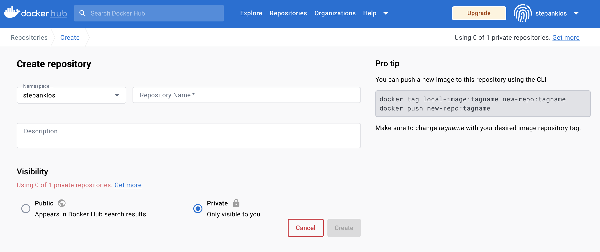
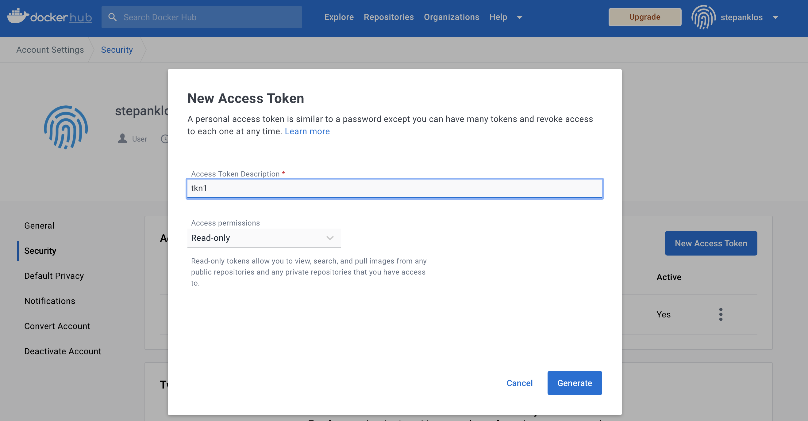
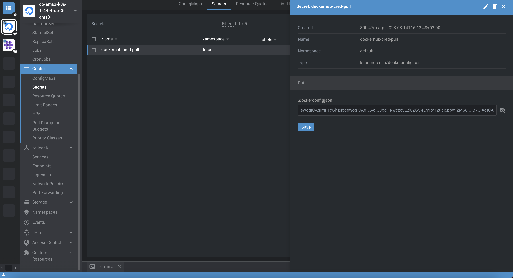

# Deploy image from private repository into your cluster
We will show you how to deploy `Docker image` [^1] from private repository to you cluster. Default space for obtaining images is [Dockerhub](https://dockerhub.com) which doesn't require:
-  neither repository address specification, i.e. images are pullable as `docker pull redis`,
- nor any login - i.e. "just pull it as it is",

and therefore is a good demostration since everybody is familiar with it.

We show how to use your `1 free private image` hosting slot on Dockerhub for your **private image**.

## 1. Create repository - Private, populate
Create 1 free **Private repository** for your project on `docker hub`.
<p align="center">
  
</p>

Build your project in project's folder (`cd ~/projects/project-folder`) and push it as   

```zsh
docker build -t stepanklos/private-image .
docker login
docker push stepanklos/private-image
```
## 2. Prepare login mechanism for Kubernetes-Dockerhub
To pull from private repository, you first need to be authenticated with Dockerhub. To achieve that, you either can use pair `e-mail/password`, which is obviously giving you access over whole Dockerhub account with all privileges. You can also create something called `Access Token` [^1] for performing specific restricted operations as `e-mail/token` in order to store it as `Kubernetes Secret` [^2] and use it for authentication while pulling in `Deployment`.
### Generate Access Token
Please navigate to `Security` section in your `Account Settings` and click `New Access Token`
<p align="center">
  
</p>

### Prepare Kubernetes Secret
Create JSON with authentication token.  
`dockerhub-cred-pull.json`
```json
{
    "auths": {
        "https://index.docker.io/v1/": {
            "username": "stepanklos",
            "password": "dckr_pat_a2l7yEhuBBHsNntBC6wK7NEV5EA"
        }
    }
}
```
Create Kubernetes Secret from `dockerhub-cred-pull.json` in your Cluster.
```zsh
kubectl create secret generic dockerhub-cred-pull \ 
    --from-file=.dockerconfigjson=/Users/you/projects/app/dockerhub-cred-pull.json \
    --type=kubernetes.io/dockerconfigjson
```
Verify whether your `Secret` was created successfully.
```zsh
kubectl get secret dockerhub-cred-pull
kubectl get secret dockerhub-cred-pull --output=yaml
kubectl get secret dockerhub-cred-pull -o jsonpath='{.data.*}' | base64 -d
```
Alternatively, view `Secret` in Lens. Clicking the `eye symbol` will perform `decoding json from base64` for readability.
<p align="center">
  
</p>

## 3. Deploy using authentication w/ token
You will have to add this snippet at the end of your Deployment.
```yaml
      imagePullSecrets:
        - name: dockerhub-cred-pull
```
This snipped should be nested in `spec:` > `template:` > `spec` > `containers:` | `imagePullSecrets:`, i.e. "on the same level as containers specification.


[^1]: https://kubernetes.io/docs/tasks/configure-pod-container/pull-image-private-registry/
[^2]: https://docs.docker.com/docker-hub/access-tokens/
[^3]: https://kubernetes.io/docs/concepts/configuration/secret/
