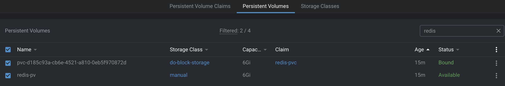
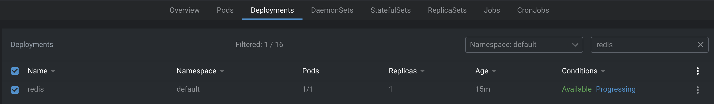
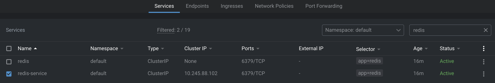
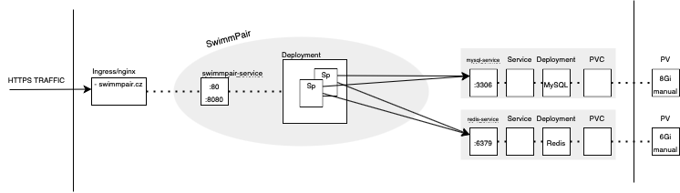

# Install Redis to K8s Cluster
Follow these 3 steps to achieve desired functionality (like previously shown `mysql-deployment`).  
https://hub.docker.com/_/redis

## 0. Generate base64 password & apply Kubernetes Secret
Generate base64 password and place it into redis-secret file.
```zsh
➜  redis-deployment git:(main) ✗ chmod u+x 0-encode-base64.zsh 
➜  redis-deployment git:(main) ✗ zsh 0-encode-base64.zsh password 
cGFzc3dvcmQ=
➜  redis-deployment git:(main) ✗ kubectl apply -f 0-redis-secret.yaml 
secret/redis-secrets created
```
## 1. Create PV & and make PVC on it
```zsh
➜  redis-deployment git:(main) ✗ kubectl apply -f 1-pv-pvc-redis.yaml  
```
<p align="center">
  
</p>

## 2. Create Service (internal) & Deployment  
```zsh
➜  redis-deployment git:(main) ✗ kubectl apply -f 2-deployment-redis.yaml 
```
<p align="center">
  
</p>

## 3. Create Service (public) - link the internal one
```zsh
➜  redis-deployment git:(main) ✗ kubectl apply -f 3-service-redis.yaml   
```
<p align="center">
  
</p>

___
## Where/how to use Redis
Redis should be running on `tcp://redis-service:6379?auth=PASSWD`  
Both **MySQL** and **Redis** are used by multireplica deployment of SwimmPair.  
<p align="center">
  
</p>
They run at usable for other applications:

- mysql-service:3306,
- redis-service:6379.
