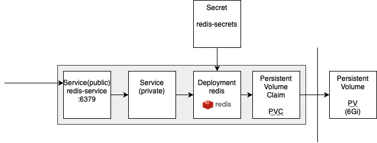

# Install Redis to K8s Cluster
Follow these steps to achieve desired functionality like previously shown in 
[**mysql-deployment**](https://github.com/KlosStepan/DOKS-tutorial/tree/main/mysql-deployment).  
Used image of Redis https://hub.docker.com/_/redis has to be wrapped in the similar manner and exposed as `redis-service:6379`.  

This tutorial shows cluster overview by [**Lens**](https://k8slens.dev/desktop.html) (via kubectl) rather than raw [**kubectl**](https://kubernetes.io/docs/tasks/tools/) CLI.
<p align="center">
  
</p>

## 0. Generate base64 password & apply Kubernetes Secret
Generate base64 password and place it into redis-secret file.
```zsh
➜  redis-deployment git:(main) ✗ chmod u+x 0-encode-base64.zsh 
➜  redis-deployment git:(main) ✗ zsh 0-encode-base64.zsh password 
cGFzc3dvcmQ=
➜  redis-deployment git:(main) ✗ kubectl apply -f 0-redis-secret.yaml 
secret/redis-secrets created
```
## 1. Create PV & and make PVC on it
```zsh
➜  redis-deployment git:(main) ✗ kubectl apply -f 1-pv-pvc-redis.yaml  
```
<p align="center">
  
</p>

## 2. Create Service (internal) & Deployment  
```zsh
➜  redis-deployment git:(main) ✗ kubectl apply -f 2-deployment-redis.yaml 
```
<p align="center">
  
</p>

## 3. Create Service (public) - link the internal one
```zsh
➜  redis-deployment git:(main) ✗ kubectl apply -f 3-service-redis.yaml   
```
<p align="center">
  
</p>

___
## Where/how to use Redis
Redis should be running on `tcp://redis-service:6379?auth=PASSWD`  
Both **MySQL** and **Redis** are were tested on multireplica deployment of our LAMP application SwimmPair.  
Peek. Visualization on how containers share databases - which have both persistent storage. Database for obvious purposes, Redis for keeping sessions live in case of reboots or death of all containers.  
<p align="center">
  
</p>
They run at usable for other applications:

- mysql-service:3306,
- redis-service:6379.

We, however, have to change php.ini to adjust PHP for using Redis for session handling as follows:
```php
session.save_handler: 'redis'
session.save_path: 'tcp://redis:6379?auth=aGVzbG8='
```
Our docker image [thecodingmachine/php:7.2-v4-apache](https://github.com/thecodingmachine/docker-images-php) has way how to override these params via [ENV VARIABLES](https://www.twilio.com/blog/2017/01/how-to-set-environment-variables.html). Both `docker-compose` and `Kubernetes Deployment` have same notation.
```yaml
    environment:
      PHP_INI_SESSION__SAVE_HANDLER: 'redis'
      PHP_INI_SESSION__SAVE_PATH: 'tcp://redis:6379?auth=aGVzbG8='
```
After that we should be able to call `phpinfo();` to see `session.save_handler` and `session.save_path` set up as mentioned above.